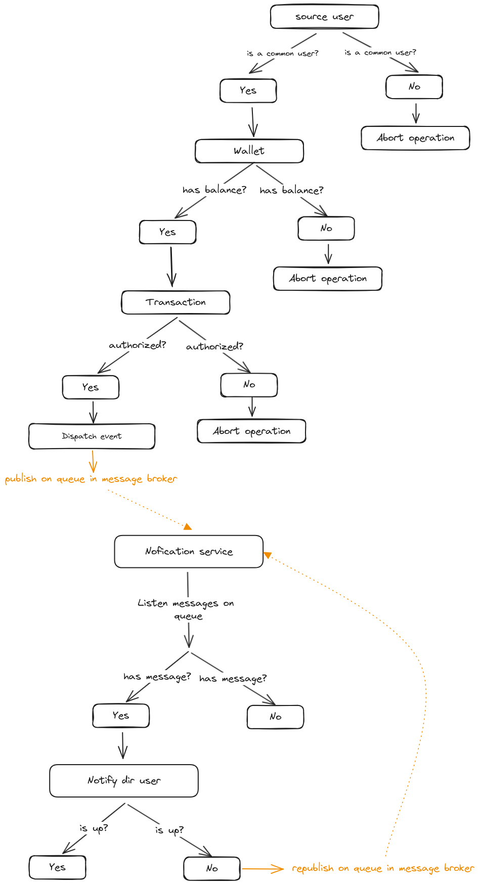

	<h1>📊 Pic Pay Challenge</h1>
	
	

## 🚀 Introduction
Solution for the PicPay challenge aimed at backend.
The requirements for the challenge can be found [here](https://github.com/PicPay/picpay-desafio-backend)

## 👨‍💻 Technologies

- [Javascript/Typescript](https://developer.mozilla.org/pt-BR/docs/Web/JavaScript): Main programming language.
- [NodeJS](https://nodejs.org/en): Platform to run Javascript
- [PostgreSQL](https://www.postgresql.org/): Relational database to store persistent data.
- [NestJS](https://nestjs.com/): Web framework for building APIs in NodeJS.
- [Prisma ORM](https://www.prisma.io/): ORM (Object-Relational Mapping) for communication with the database.
- [Docker](https://www.docker.com/): Development environment for PostgreSQL and Redis.
- [RabbitMQ](https://www.rabbitmq.com/): Message broker to handle asynchronous communication through queues

## 🏗️ Design Patterns

The application follows the following design patterns:

1. **Clean Architecture**: The project structure is organized in layers (entities, use cases, interfaces) to separate concerns and facilitate maintenance.

2. **Domain Driven Design (DDD)**: The software design is domain-oriented, focusing on business rules and main entities.

3. **Dependency Injection**: Inversion of control and dependency injection are used to ensure code flexibility and testability.

4. **Automated Testing**: Unit, integration and end-2-end tests are written to ensure code quality.

5. **Asynchronous Communication**: Asynchronous communication within a system brings the possibility of making parts communicate through messages, without waiting for an immediate response.

## 🔄 Domain Events

One of the highlights of this solution is the use of **Domain Events**. This concept ensures data consistency when a user performs a transfer and a notification must be sent to the end user. By taking advantage of domain events, the business logic related to sending notifications is decoupled from the core of the application, which is making money transfers. In the future it is even possible to abstract this part of the application to another service running on any other technology.

## 🎯 Main Features

- [x] Perform money transfer operations between users

## 🔧 Running the project

To run this application, you need to have [NodeJS](https://golang.org/) and [Docker](https://www.docker.com/) installed on your machine.

- Run the command `touch .env .env.test && cp .env.example .env .env.test` to create environment variable files.
- Start the docker services using: `docker-compose up -d`
- Run the command `pnpm i` to download the dependencies. You can use the package manager you prefer
- Run the command `pnpm prisma migrate deploy` to apply the migrations to the database.
- Run the command `pnpm prisma db seed` to populate the database with some initial data
- Run the command `pnpm dev` to start the application.
- Open the `client.http` file at the root of the project to call the http route that performs the operation. It is important to have the [Rest Client](https://marketplace.visualstudio.com/items?itemName=humao.rest-client) extension installed in VsCode

## 🧪 Tests

- Run the command `pnpm test` to run the unit tests
- Run the command `pnpm test:e2e` to run the end-to-end tests

## ✍🏽 Important learnings
- Communication between external services and how to bring resilience to the project since external services may suffer instabilities

## 🧑‍💻 Possible improvements
- Authentication services for the system
- Separate the domain of the application into other bounded contexts for better maintenance, scalability and readability of the project
- Use of Value Objects: Value objects offer a more interesting way of typing data given the specific behaviors that each piece of data can have, such as an Email, CPF or CNPJ that have specific data formats and their own validations.
- Add observability features for metrics and logs
- Store notification messages for history
- Possible better abstraction to deal with sending SMS or email

## 📝 Application flow

## 📄 License

This project is under the MIT license. Access the link [LICENSE](https://mit-license.org/) for more details.

## 🌐 GitHub

The source code of the application can be found on GitHub: [Project Link](https://github.com/nitoba/picpay-challenge)

## 📧 Contact

In case of doubts or suggestions, contact us through the email: [nito.ba.dev@gmail.com](mailto:nito.ba.dev@gmail.com).

